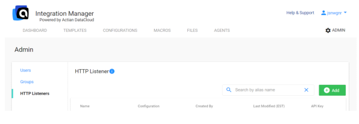
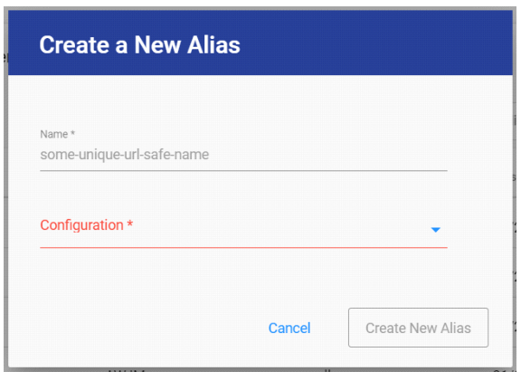
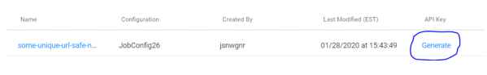
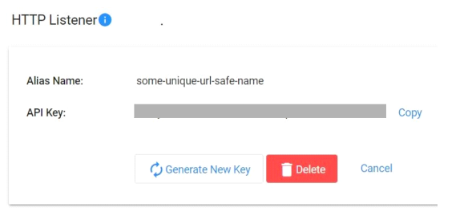

# JobConfig Aliasing

* Create custom/branded API endpoints for your internal and external integration consumers
* Seamlessly upgrade/downgrade/exchange the backend integration without disruption to consumers
* Use various access control mechanisms for your custom API endpoint, including:
    * Basic User Authentication (username/password)
	* API Keys (defined separately for each Alias you create)
	* Public access (not recommended to service consumers outside of your internal network)

## Step 1: Create Alias

1. Go to Admin Console -> Listeners
2. Click Add
* 
3. Create a globally unique, URL-safe name for your Alias. This is the endpoint your consumers will use.
4. Select the backend JobConfig to run when your Alias is invoked. You can change it as needed.
* 
5. Click Create New Alias

## Step 2: Secure Alias

1. Click the Generate link to create an API Key for your Alias
* 
* 
2. You can re-generate or delete this key at anytime to revoke consumer access

## Step 3: Test/Invoke Alias

You can invoke an Alias, that is, run a JobConfig, through the Job Execution API in several ways with several options. Note that your Alias only exposes the ability to execute a JobConfig with parameters. No user or configuration data is accessible through the Listener API.

* If ONLY api key is set, then it must be supplied via the 'x-api-key' header
* If BOTH api key and api secret are set, then Authorization: Basic is required, in the format of Base64Encode(api-key:api-secret)
* (Discouraged) Aliases support User credential authentication, Authorization: Basic is required, in the format of Base64Encode(username:password)
* (Discouraged) Public Aliases do not require any authentication

See the Job Execution API for more details: [https://api.im.actiandatacloud.com/v2/apidocs/#/Job%20Execution/runAliasWithMessage](https://api.im.actiandatacloud.com/v2/apidocs/#/Job%20Execution/runAliasWithMessage).