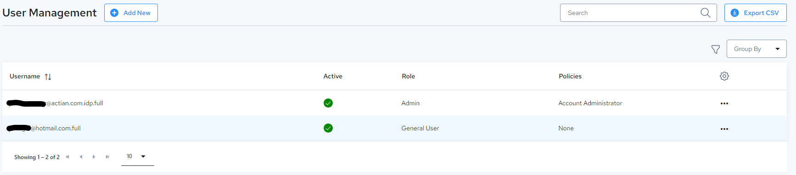
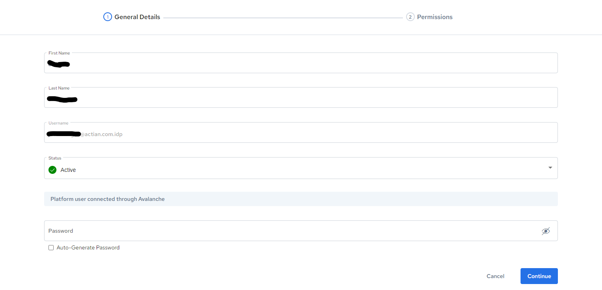
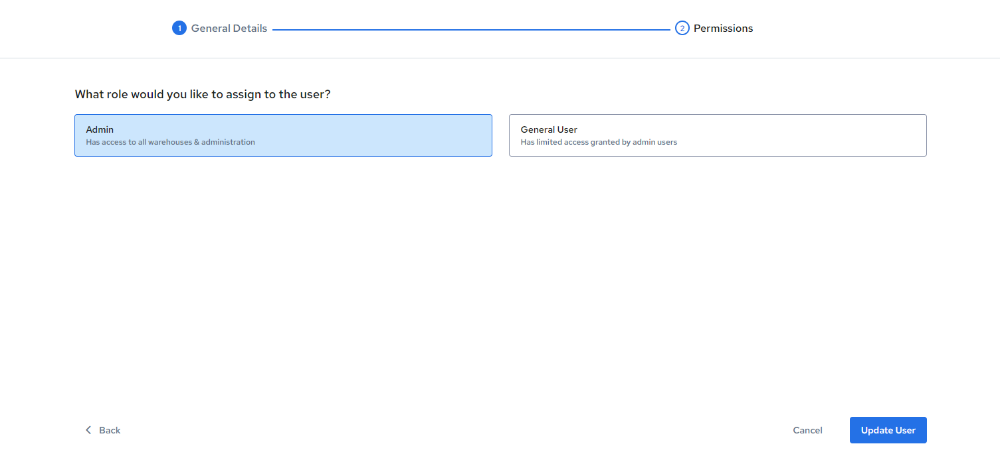

# User Management

Users can be created and managed within the [Administration Console](https://im.dev.actiandatacloud.com/ui/admin/users). Note that User Management requires Account Admin access.

## Edit User

Note that usernames cannot be changed once created, they can only be deactivated.

Non-admin users can edit their own profile info and password.

Users (admin and non-admin alike) are not allowed to activate/deactivate, or enable/disable Admin Access for themselves.

Account administrators can:
* Edit User Profile Information
* Activate/Deactivate User
* Enable Direct API Access for User (where required)
* Create, generate, reset API Password for User
* Enable/Disable Admin Access for User

