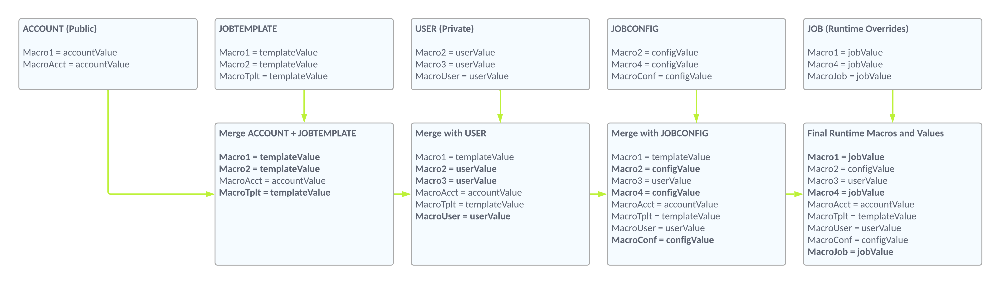

# Macro Hierarchy

## Overview

Macros use a hierarchy to allow flexibility (and privacy) across your deployed integrations.

In a nutshell the macros are applied and overridden in the following order: 

## Account (Public) Macros

Account-level macros are global and read-only.&#x20;

They can be viewed by all users in your account. They can only be created, edited, deleted by account admin users.

## Job Template Macros

Job Template macros increase portability of your integrations. They will apply to any Job Config that is a child of this Job Template.

They can be viewed by any user who has at least read access to the Job Template. They can only be created, edited, deleted with write access to the Job Template, by the Job Template owner, or by Account Admins.

Job Templates are designed to allow reuse of common integration artifacts and Job Config values that apply to multiple integration configurations. For example, you may have several customers or departments within your company who send you the same data format. You could create a single integration Job Template to hold your common integration artifacts (maps, scripts, etc) and common macro values, then create a separate Job Config for each - where you only need to override a few macro values that are specific to them.

Note that templates are completely optional. Many configurations will not have a Job Template. This layer of the hierarchy will be ignored for any configurations without a Job Template.

## User (Private) Macros

User macros can further increase the portability AND privacy of your integrations. User macros are applied for the **submitted by** user when a job is executed. Submitted by will always be the Job Config owner for scheduled jobs.

They can only be viewed, created, edited, deleted by the associated user, or by account admin users.

User macros are great for individual users to manage their own credentials to connected systems.

## Job Config Macros

They can be viewed by any user who has at least read access to the Job Config. They can only be created, edited, deleted with write access to the Job Config, by the Job Config owner, or by account admin users.

 

### Example Inheritance:
