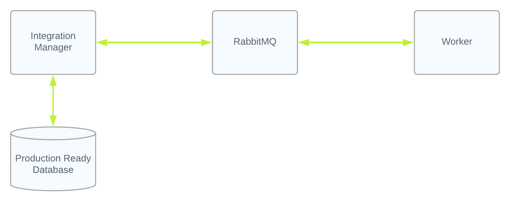
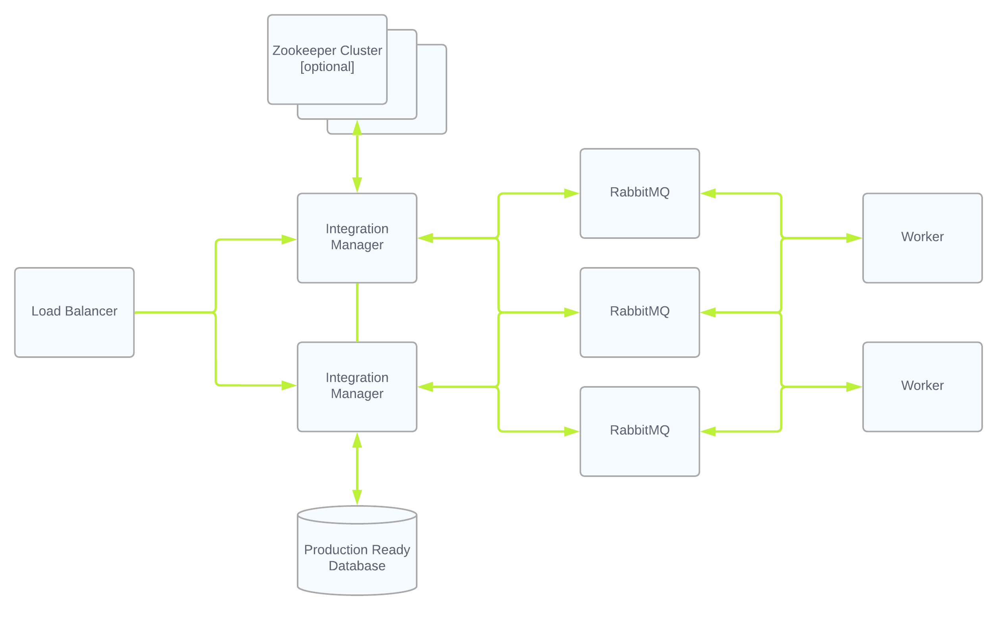

# Production Architecture

Note that the default installation of Integration Manager uses an embedded file-based database and in-memory job queueing. It is only appropriate for trial and demo use.

The following are high-level recommendations only. Actual production deployemtns should be examined for many other factors, including but not limited to desired workload.

## Minimum Production Ready Capabilities

The bare minimum restartability and recovery capabilities for a production-ready system requires multiple components, each requiring their own server or VM:
* Integration Manager Core
* Integration Worker
* RabbitMQ Broker
* Production-ready Database (MySQL, MariaDB, MS SQL Server)
* Expandable network storage enabled for Integration Manager Core

This type of deployment looks something like:

## Minimum Production Ready Capabilities with HA

The minimum HA capabilities for a production-ready system requires redundant components:
* Integration Manager Core (at least 2 servers/VMs)
* Integration Workers (at least 2 server/VMs)
* RabbitMQ Cluster (see [https://www.rabbitmq.com/distributed.html](https://www.rabbitmq.com/distributed.html) for minimum requirements)
* Production-ready Database (MySQL, MariaDB, MS SQL Server) (see vendor documentation for HA configuration)
* Expandable network storage enabled for Integration Manager Core

This type of deployment looks something like:

