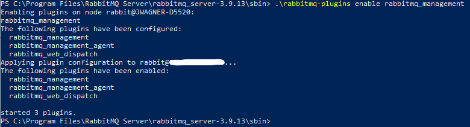

# RabbitMQ

## Overview

RabbitMQ is lightweight and easy to deploy on premises and in the cloud. It supports multiple messaging protocols. RabbitMQ can be deployed in distributed and federated configurations to meet high-scale, high-availability requirements.

Integration Manager is compatible with RabbitMQ 3.9 or higher. RabbitMQ 3.9 requires Erlang OTP 24. The following steps only apply to a single node RabbitMQ installation.

Integration Manager is also fully compatible with clustered RabbitMQ deployments, please refer to the official RabbitMQ clustering guide: [https://www.rabbitmq.com/clustering.html](https://www.rabbitmq.com/clustering.html)

### Note

Steps 1-4 are for Windows installation only, for Linux instructions please see the official RabbitMQ documentation, then skip to Step 5:
* RPM-based: [https://www.rabbitmq.com/install-rpm.html](https://www.rabbitmq.com/install-rpm.html)
* Debian/Ubuntu: [https://www.rabbitmq.com/install-debian.html](https://www.rabbitmq.com/install-debian.html)

## Step 1: Install Erlang OTP

1. Download Erlang OTP 24 for Windows: [https://github.com/erlang/otp/releases/download/OTP-24.2.1/otp_win64_24.2.1.exe](https://github.com/erlang/otp/releases/download/OTP-24.2.1/otp_win64_24.2.1.exe)
2. Run as administrator
3. Install using default configuration (approx. 350MB)

## Step 2: Install RabbitMQ

1. Download RabbitMQ 3.9 for Windows: [https://github.com/rabbitmq/rabbitmq-server/releases/download/v3.9.13/rabbitmq-server-3.9.13.exe](https://github.com/rabbitmq/rabbitmq-server/releases/download/v3.9.13/rabbitmq-server-3.9.13.exe)
2. Run as administrator
3. Install using default configuration (approx. 30 MB)
4. Choose "Allow access" for "Domain networks..." in Windows Defender Firewall, if prompted

## Step 3: Verify RabbitMQ Service

1. Go to Windows → Services
2. Confirm RabbitMQ service is registered and running

## Step 4: Configure RabbitMQ Console

1. Open a Windows console
2. Go to the sbin directory: cd "C:\Program Files\RabbitMQ Server\rabbitmq_server-3.9.13\sbin"
3. Enable the rabbitmq_management plugin: .\rabbitmq-plugins enable rabbitmq_management


If you have any issues with the installation, please refer to the official RabbitMQ documentation: [https://www.rabbitmq.com/install-windows.html](https://www.rabbitmq.com/install-windows.html).

## Step 5: Configure RabbitMQ User(s)

1. Open a browser window
2. Go to: http://localhost:15672/
3. Login (first time): Username: guest, Password: guest
4. Click the "Admin" tab
5. Click "Add a user"
6. Add credentials for Integration Manager (username/password)
7. Add the "Admin" tag to the user

## Step 6: Configure Integration Manager Queue Properties

* Integration Manager uses the "queue" prefix properties in the /conf/application.properties file to connect to the RabbitMQ broker
* Note that queue.port is for the messaging port (default: 5672) and is different from the management API/console port (default: 15672)
* Note that any application.properties change requires a restart of the Integration Manager Service
* Example properties to connect Integration Manager to a RabbitMQ Server:
```
# Messaging Configuration
queue.host=RABBITMQ_HOSTNAME
queue.port=5672
queue.username=RABBITMQ_USERNAME
queue.password=RABBITMQ_PASSWORD
queue.connectionTimeout=20
queue.management-url=http://RABBITMQ_HOSTNAME:15672
```

## Enabling TLS for RabbitMQ

If you have a cloud or inter-network installation, then you should enable TLS for RabbitMQ: [https://www.rabbitmq.com/ssl.html](https://www.rabbitmq.com/ssl.html).

You will also need to add SSL properties to the Integration Manager messaging configuration:
```
queue.ssl.enabled=true
queue.ssl.key-store=KEYSTORE FILE LOCATION
queue.ssl.key-store-password=KEYSTORE_PASSWORD
queue.ssl.key-store-type=KEYSTORE_TYPE, e.g. PKCS12
queue.ssl.protocol=TLSv1.2
```