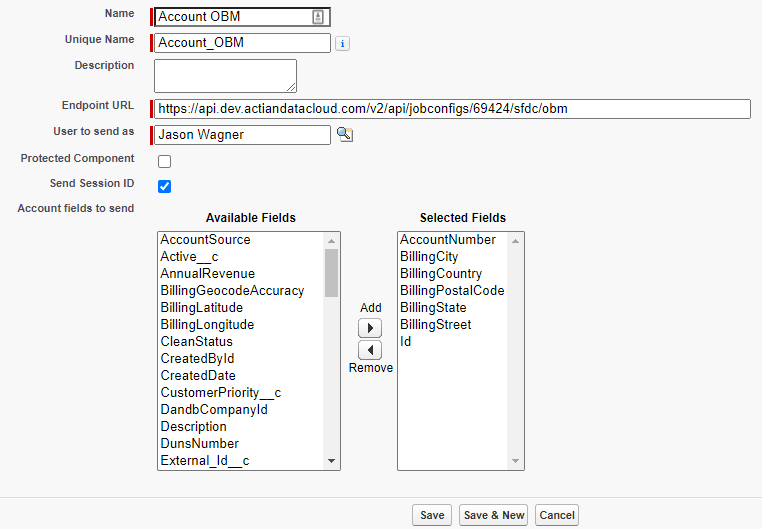

# Salesforce.com Outbound Messaging API

## Overview

The Salesforce.com Outbound Messaging API securely and asynchronously processes outbound messages sent from your Salesforce.com organization.

These outbound messages will execute a desired configuration and can pass any of the data contained within the OBM to your integration. Now, any time your workflow rule is triggered, an outbound message will be sent to DataCloud and your job configuration will execute. Of course, your integration needs to know what to do with the message!

You must have setup/configuration privileges within the Salesforce.com org, typically a System Administrator profile.

**Tip:**  You can monitor the messages in Salesforce by going to Setup > Administration Setup > Monitoring > Outbound Messages.

## Step 1: Create a new Custom Setting

1. Go to Setup > Develop > Custom Settings >
2. Click New
    * Label = DataCloud User Credential
    * Object Name = DataCloud_User_Credential
    * Setting Type = Hierarchy
    * Visibility = Public
3. Click Save
4. Go to Custom Fields >
5. Click New
    * Data Type = Text
6. Click Next
    * Field Label = Username
    * Length = 120
    * Field Name = Username
7. Click Next
8. Click Save & New
9. Go to Custom Fields >
10. Click New
    * Data Type = Text
11. Click Next
    * Field Label = Password
    * Length = 120
    * Field Name = Password
12. Click Next
13. Click Save

## Step 2: Create a new DataCloud User Credential

1. Go to Setup > Develop > Custom Settings >
2. Click Manage next to the "DataCloud User Credential" setting
3. Click New
4. Add the DataCloud username and password that the outbound message will use to authenticate
5. Click Save

## Step 3: Create a new Workflow Rule and Outbound Message

1. Go to Setup > Create > Workflow & Approvals > Workflow Rules >
2. Click New Rule
3. Set up your Workflow Rule:
    * Name
    * Evaluation Criteria
    * Rule Criteria
4. Click Save & Next
5. Click Add Workflow Action > New Outbound Message
6. Set up your Outbound Message:
    * Name
    * Unique Name
    * Endpoint (e.g., https://api.im.actiandatacloud.com/v2/api/jobconfigs/[jobconfig id]/sfdc/obm)
    * [Salesforce.com] User to send as
    * Send Session ID = true
    * Object fields to send (These fields will be available as an XML DJMessage object within your integration.)
	
7. Click Save (Outbound Message)
8. Click Done (Outbound Message)
9. Click Activate (Workflow Rule)